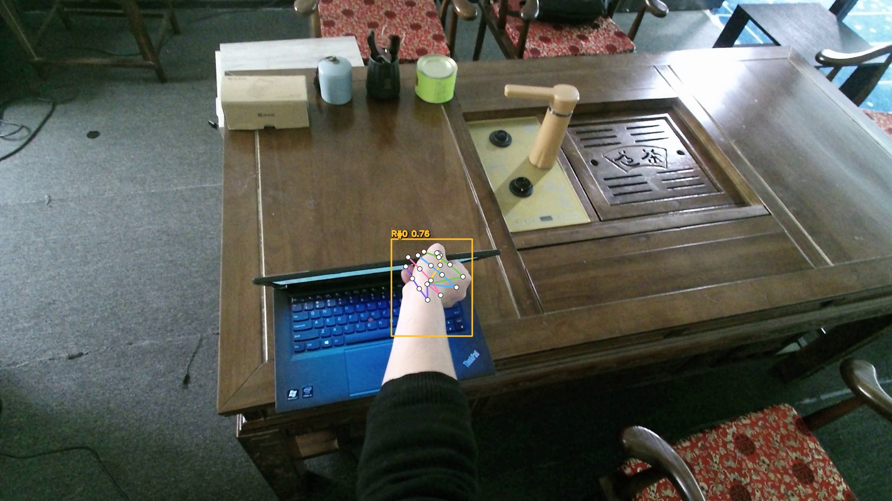
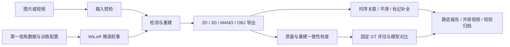

# EgoHand3D

**基于 WiLoR 的第一视角 RGB 手部姿态估计适配与处理软件。**

EgoHand3D 沿用 [WiLoR](https://github.com/rolpotamias/WiLoR) 的重建网络与 MANO 表示，
通过第一视角数据训练/微调，使模型更适配第一视角手部图像。
本仓库整理现有训练配置、推理与参数导出、视频后处理、可恢复批处理、评估及真实结果。
新增工作集中在应用流程；没有宣称重新设计 WiLoR 核心网络。全部功能由命令行运行。

## 先看结果

[**手部三维网格重建图片（2026-10-09）**](results/reconstruction_images_20261009/README.md)：5 组第一视角微调结果和 1 组初始模型双手样例，包含原图、网格叠加图与放大对照图。直接渲染已有预测，没有重新推理。

2026-10-01 重新运行同一批 100 张 HOI4D 样例、同一检测器与匹配协议：

| 指标 | 初始 WiLoR | 第一视角微调权重 |
|---|---:|---:|
| 匹配标注手 / 总标注手 | 85 / 100 | 85 / 100 |
| 匹配关节平均二维误差 | 17.0416 px | 8.2124 px |
| 全 GT PCK@10 px（漏检计错） | 32.00% | 63.76% |
| 全 GT PCK@20 px（漏检计错） | 59.00% | 78.38% |
| MANO 参数重建一致性失败 | 0 / 94 | 0 / 94 |

标注仅覆盖每张图的一只目标手；不是完整检测标注。尚未核实这些样例与训练数据完全不重叠，
因此表格是固定样例对比，不能单独证明独立测试集泛化性能。本轮没有真实三维 GT 评估。
已有微调权重带来了上述精度差异，新增导出和任务管理模块并不改变网络预测精度。

- [评估条件与验证记录](docs/VALIDATION_20261001.md)
- [两模型对比报告](results/validation_20261001/comparison/report.md)
- [初始模型评估](results/validation_20261001/eval_baseline/report.md) / [微调模型评估](results/validation_20261001/eval_finetuned/report.md)
- [视频处理报告](results/validation_20261001/video_sequence/report.md) / [原始与处理后并排 MP4](results/validation_20261001/video_sequence/f191bb737fc68685d387_comparison.mp4)
- [全部当前结果下载、解压与校验](artifacts/README.md)

真实视频验证处理 32 个采样帧，得到 88 条检测手记录、4 个轨迹 ID、7 条明确标记的插值记录。
MANO 一致性检查验证参数导出与解码闭环，不代表预测接近真实姿态。



## 完整流程



1. [运行环境与外部依赖](docs/REPRODUCIBILITY.md)：模型、MANO 和数据需要自行准备。
2. [第一视角训练配置](docs/TRAINING.md)：保存真实 run 配置、数据混合比例与已有权重身份。
3. [命令行完整操作手册](docs/HEADLESS_WORKFLOW.md)：预检、推理、断点恢复、参数检查、时序处理、评估和归档。
4. [源码交存材料说明](registration/README.md)：新增应用模块的完整源码与依赖范围。

## 快速使用

在准备好兼容的本地 WiLoR 运行时与模型资产后，在仓库根目录执行：

```bash
python -m egohand3d.workflow --help
python -m egohand3d.workflow scan \
  --input examples/egocentric_sequence/inputs/cam0 --out outputs/preflight.json
python -m egohand3d.workflow process \
  --input examples/egocentric_sequence/inputs/cam0 --out outputs/demo
python -m egohand3d.workflow jobs --run outputs/demo
```

`python egohand3d_cli.py ...` 保留旧命令，并支持同一套新流程子命令。
新入口 `python -m egohand3d.workflow` 只注册本次流程功能。

完整两模型比较可用 [scripts/reproduce_validation.sh](scripts/reproduce_validation.sh)。
无需 GPU 或模型的应用逻辑验证：

```bash
python -m pip install -r requirements-dev.txt
python -m pytest -q tests
```

## 仓库内容

| 路径 | 内容 |
|---|---|
| `egohand3d/` | 既有适配器及新增流程模块 |
| `tools/`, `scripts/`, 根目录脚本 | 兼容入口、训练入口、复现实验、文档生成工具 |
| `configs/` | 真实微调配置、运行时 Hydra 配置与推理配置 |
| `dependencies/` | 实验使用的外部代码、资产及环境指纹 |
| `results/validation_20261001/` | 本轮真实报告、曲线、预览和视频 |
| `artifacts/` | 全部当前结果的四个独立 ZIP 包及逐文件校验清单 |
| `results/hoi4d/` | 历史实验摘要；评估口径与本轮不同，不能直接混合 |
| `examples/egocentric_sequence/` | 真实第一视角输入样例和旧版导出 |
| `sample_outputs/` | 旧版格式示例，包含示意数值，不作为本轮实验依据 |
| `registration/` | 交存范围、PDF、Word、源码全文和逐行映射 |

`wilor/` 网络实现、模型权重、MANO 模型文件及原始数据集作为外部依赖；不包含在本次发布中。
本地 WiLoR 含训练和兼容性扩展，直接克隆官方上游不等于获得完全相同的运行时。
具体接口和已验证条件见 [复现说明](docs/REPRODUCIBILITY.md)。

## 来源与许可

请保留 [THIRD_PARTY_NOTICES.md](THIRD_PARTY_NOTICES.md) 中的模型与数据归属说明。
WiLoR、MANO、检测器与数据集分别遵循自身许可。本仓库没有为这些内容重新授予许可。
旧训练/导出脚本含与本地 WiLoR 相同或近似的代码，来源待核；这些脚本不进入新增应用层交存稿。
[来源对比清单](registration/source_overlap_audit.json) 记录检查范围和实际相同项。
