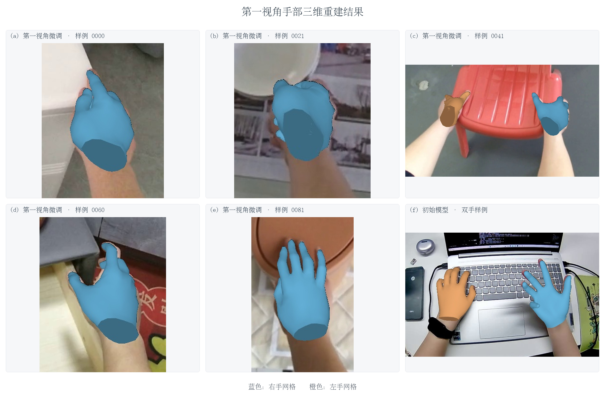
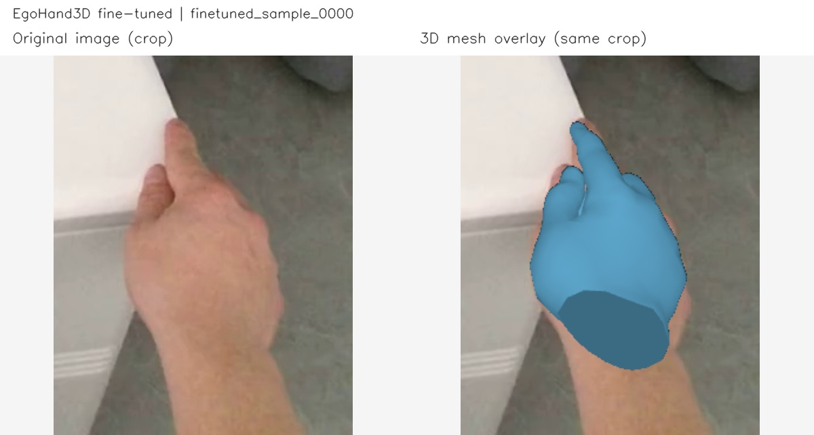
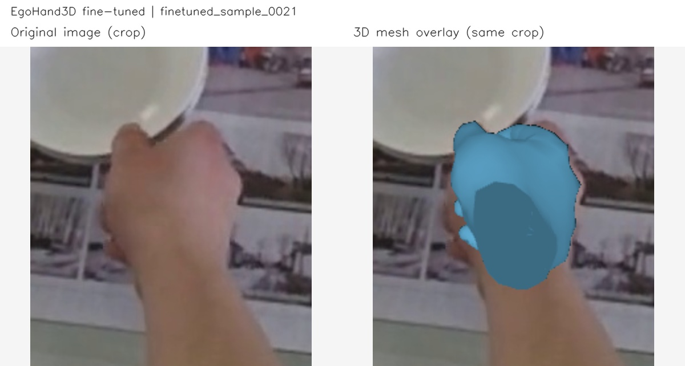
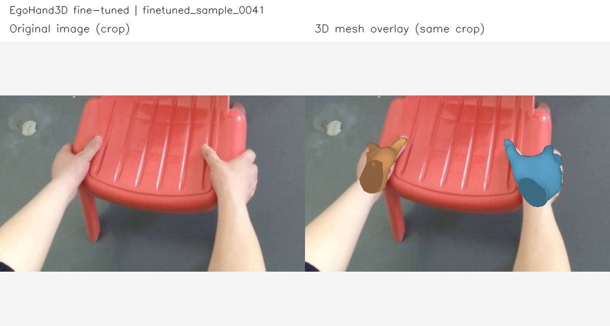
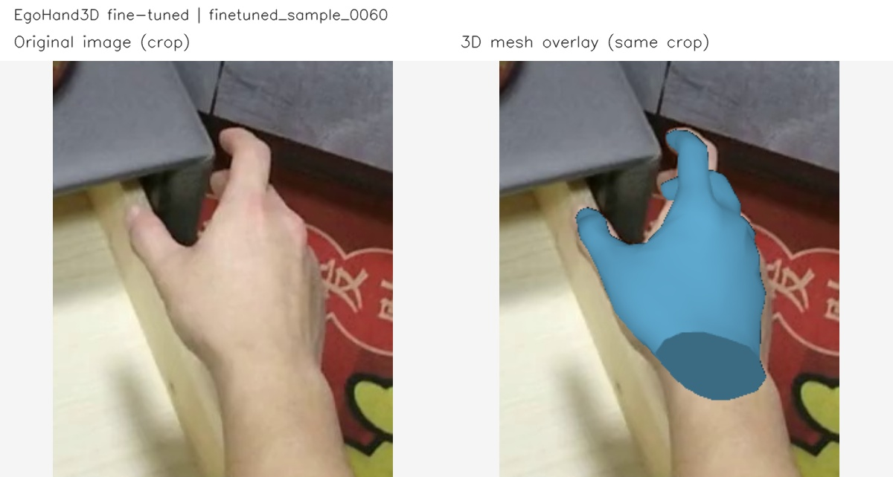
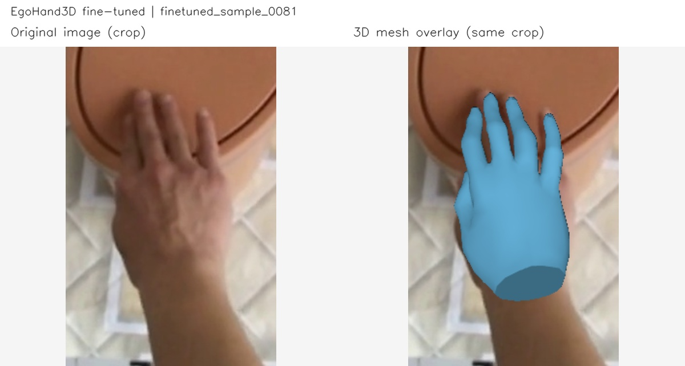
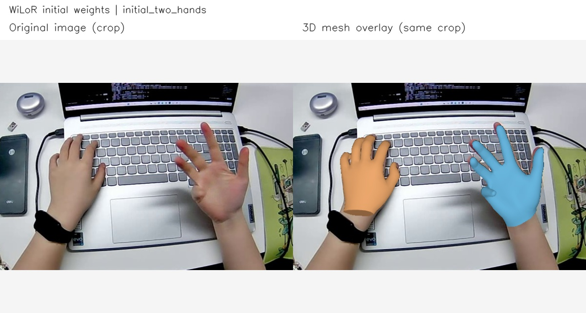

# 手部三维重建结果图片

直接根据此前保存的三维预测顶点生成，**没有重新运行模型推理，也没有修改预测的手部形状**。

对照图左边为原图裁剪，右边为相同区域的三维网格叠加图。蓝色为右手，橙色为左手。

前五组来自第一视角微调模型，最后一组来自初始 WiLoR 权重。图片按固定索引取样，遇到无检测记录顺延，未按误差挑选。

图片叠加没有处理场景物体对手部的遮挡；用于展示预测网格，精度结论请参阅[已有评估报告](../validation_20261001/comparison/report.md)。

## 六图拼接大图

六张已有三维网格叠加图按 2 行 3 列排列，右下角为初始模型结果，其余为第一视角微调结果。

- **手部放大版（2496 × 1630）**：[PNG](mesh_overlay_montage_detail.png) / [JPG](mesh_overlay_montage_detail.jpg)，适合说明书中展示手部细节。
- **完整画面版（3968 × 1844）**：[PNG](mesh_overlay_montage.png) / [JPG](mesh_overlay_montage.jpg)，保留六张原图的完整视野。

仅对原有图片做排版、等比例缩放及按已有区域裁剪，没有重新推理或修改预测网格。来源及校验值见 [montage_manifest.json](montage_manifest.json)。

## 1. 第一视角微调模型 · finetuned_sample_0000

[查看对照图](finetuned_sample_0000_comparison.jpg) · [完整网格叠加图](finetuned_sample_0000_mesh_overlay.jpg) · [白底三维手部图](finetuned_sample_0000_mesh_only.png) · [原图](finetuned_sample_0000_input.jpg)

## 2. 第一视角微调模型 · finetuned_sample_0021

[查看对照图](finetuned_sample_0021_comparison.jpg) · [完整网格叠加图](finetuned_sample_0021_mesh_overlay.jpg) · [白底三维手部图](finetuned_sample_0021_mesh_only.png) · [原图](finetuned_sample_0021_input.jpg)

## 3. 第一视角微调模型 · finetuned_sample_0041

[查看对照图](finetuned_sample_0041_comparison.jpg) · [完整网格叠加图](finetuned_sample_0041_mesh_overlay.jpg) · [白底三维手部图](finetuned_sample_0041_mesh_only.png) · [原图](finetuned_sample_0041_input.jpg)

## 4. 第一视角微调模型 · finetuned_sample_0060

[查看对照图](finetuned_sample_0060_comparison.jpg) · [完整网格叠加图](finetuned_sample_0060_mesh_overlay.jpg) · [白底三维手部图](finetuned_sample_0060_mesh_only.png) · [原图](finetuned_sample_0060_input.jpg)

## 5. 第一视角微调模型 · finetuned_sample_0081

[查看对照图](finetuned_sample_0081_comparison.jpg) · [完整网格叠加图](finetuned_sample_0081_mesh_overlay.jpg) · [白底三维手部图](finetuned_sample_0081_mesh_only.png) · [原图](finetuned_sample_0081_input.jpg)

## 6. 初始 WiLoR 模型（双手流程样例） · initial_two_hands

[查看对照图](initial_two_hands_comparison.jpg) · [完整网格叠加图](initial_two_hands_mesh_overlay.jpg) · [白底三维手部图](initial_two_hands_mesh_only.png) · [原图](initial_two_hands_input.jpg)

## 文件说明

- `*_comparison.jpg`：原图和三维网格的放大对照，适合运行结果展示。
- `*_mesh_overlay.jpg`：保持原始图片尺寸的网格叠加图。
- `*_mesh_only.png`：同一相机视角下的白底手部网格。
- [manifest.json](manifest.json)：原始预测记录、运行配置路径、图片校验值及投影一致性记录。
- [index.html](index.html)：下载本目录后可在浏览器打开的离线预览页。GitHub 在线查看请使用本 README。
- [render_saved_meshes.py](render_saved_meshes.py)：本次渲染脚本，依赖原始运行结果和输入图像，非重新推理入口。

复现时将脚本置于项目的 `outputs/reconstruction_images_20261009/`，还原 `outputs/validation_20261001/hoi4d_finetuned/` 和 `outputs/workflow_smoke_02/`；输入图像按预测记录中的 `source_path` 准备或调整路径。已有预测记录可从[结果归档](../../artifacts/README.md)恢复。

结果沿用 WiLoR 网络与 MANO 表示，来源说明见仓库的 [THIRD_PARTY_NOTICES.md](../../THIRD_PARTY_NOTICES.md)。
