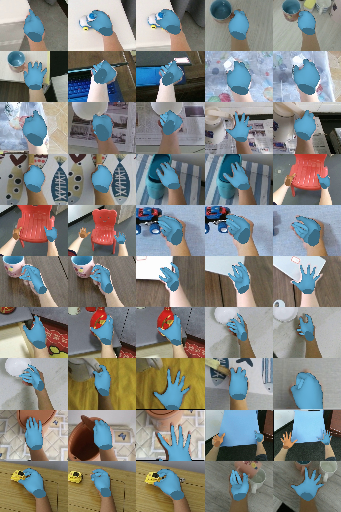

# 50 张三维网格叠加图

- [手部区域拼图 PNG（3200 × 4800）](mesh_overlay_50_no_text.png) / [JPG](mesh_overlay_50_no_text.jpg)
- [完整画面拼图 PNG（3200 × 3600）](mesh_overlay_50_full_frame_no_text.png) / [JPG](mesh_overlay_50_full_frame_no_text.jpg)
- [50 张单独的网格叠加图](overlays/)

拼图为 10 行 × 5 列，不添加标题、名称、编号、图例或说明文字。全部使用第一视角微调模型的已有预测；没有重新训练或重新推理。

保留之前 5 张微调样例，从剩余有效预测中按固定间隔补充 45 张；未按 GT 误差挑选。三维顶点未修改，仅渲染并拼接显示；手部区域版在保证网格完整的前提下裁剪周围画面。完整画面版保留输入视野。

来源、排列顺序和校验值见 [manifest.json](manifest.json)，渲染脚本见 [render_mesh_overlay_50.py](../render_mesh_overlay_50.py)。
